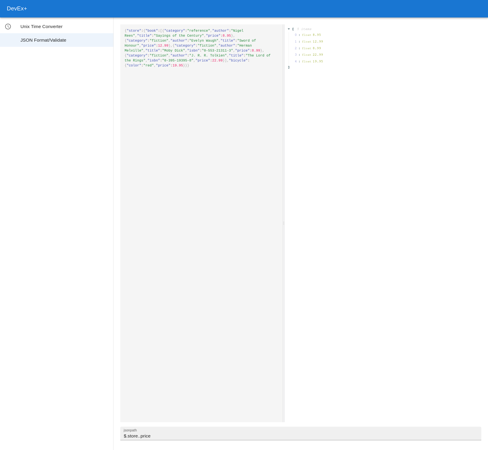

# DevEx+ (dev-ex-plus)

This is a developer utility tool which aspires to be a local or web application with a focus on simple but convenient tools for developers.

- [X] Unix timestamp convertor
- [X] JSON Formatting and JSONPath extraction
- [ ] Base64 encoding/decoding
- [ ] Regex tester
- [ ] Markdown preview
- [ ] Color picker (RGB, HSL, etc), conversions from hex to dec
- [ ] Plugin support

## Plugins

The intention is to provide a plugin API. This will be through NPM packages (although they don't have to be hosted on NPM).
That is the easiest way I could think of to allow distribution and ease of installation.

The only requirements are they they export a default which renders a React Component. DevEx+ handles the rest.

## Screenshots

